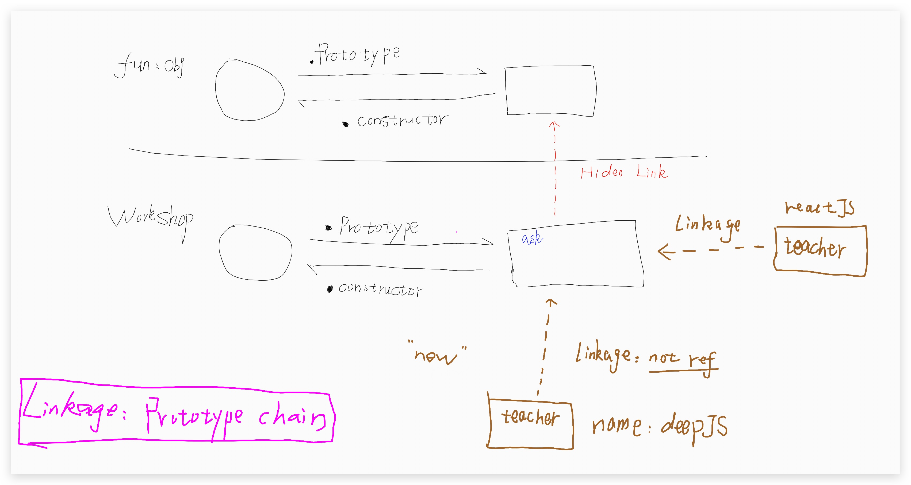

<!-- START doctoc generated TOC please keep comment here to allow auto update -->
<!-- DON'T EDIT THIS SECTION, INSTEAD RE-RUN doctoc TO UPDATE -->
## Table Of Content

- [Prototype](#prototype)
  - [Constructor Call](#constructor-call)
  - [Old School Prototyping](#old-school-prototyping)
  - [Prototype Chain](#prototype-chain)
  - [Dunder Prototypes](#dunder-prototypes)
    - [Binding Override](#binding-override)
    - [`prototype` on Arrow Function](#prototype-on-arrow-function)
    - [`this` vs `super`](#this-vs-super)

<!-- END doctoc generated TOC please keep comment here to allow auto update -->

## Prototype
### Constructor Call
- Objects are created by 'constructor' call(`new` method);
- A 'Constructor call' make object onits own **prototype**
- A 'Constructor call' make a link to its prototype
 
### Old School Prototyping
```javascript
function Workshop(teacher){
  this.teacher = teacher;
}

Workshop.prototype.ask = function(question) {
  console.log(this.teacher, question);
}

var deepJS = new Workshop("Kyle");
var reactJS = new Workshop("Suzy");

// deepJS doesn't have the ask method, how can he call it?
// by default, if there is no property existing in current object, it will go up
deepJS.ask("Deep JS");
reactJS.ask("React JS"); 
```
### Prototype Chain
- `contructor` is only a name, it's not like the constructor in other programming language, like `java`
- **Contructor** function has only `one` instance, **prototype** only has `one` instance, but the objects, essentially the `execution context` has `many`.
- 对象创建的过程，其实是创建同一构造器，不同execution context的过程。
<div style="text-align:center; margin:auto"></div> 

### Dunder Prototypes
```javascript
function Workshop(teacher){
  this.teacher = teacher;
}

Workshop.prototype.ask = function(question){
  console.log(this.teacher, question);
}

var deepJS = new Workshop('Kyle');

deepJS.constructor === Workshop; // true
deepJS.__proto__ === Workshop.prototype; // true
Object.getPrototypeOf(deepJS) === Workshop.prototype; // true
```

- deepJS doesn't have a property called `constructor`, so it goes up to its **prototype** and then it could find it, which is the **Workshop** function
- `deepJS` doesn't have the **dunder property**, so it goes up its `prototype`, but found nothing called `__proto__`, so it continues to go up to the **Object's prototype** and then found it! But, unexpectedly ,the `__proto__` is actually a **function**, not a state, it's a **getter** function. `deepJS.__proto__` will use the deepJS as execution context and get the prototype of deepJS.

#### Binding Override
- If you have already use `bind`,
- You can only use `new` to override the binding object;

#### `prototype` on Arrow Function
- Arrow Function doesn't have any prototype.
- So you can not call `new` on an arrow function.

#### `this` vs `super`
- `super` is determined during complilation time

