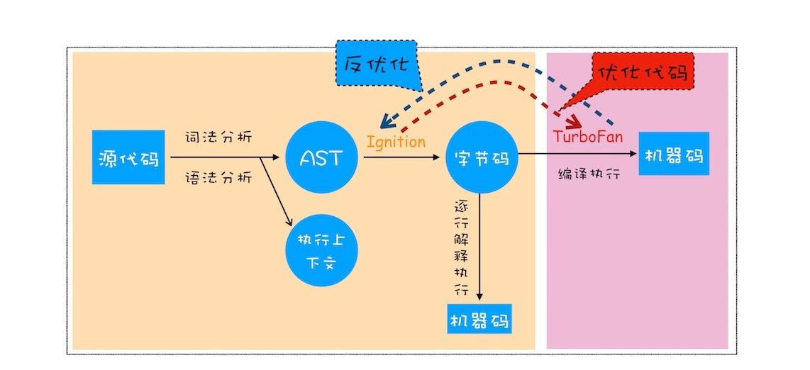

<!-- START doctoc generated TOC please keep comment here to allow auto update -->
<!-- DON'T EDIT THIS SECTION, INSTEAD RE-RUN doctoc TO UPDATE -->
## Table Of Content

- [v8引擎基本原理](#v8%E5%BC%95%E6%93%8E%E5%9F%BA%E6%9C%AC%E5%8E%9F%E7%90%86)
  - [编程语言类型](#%E7%BC%96%E7%A8%8B%E8%AF%AD%E8%A8%80%E7%B1%BB%E5%9E%8B)
    - [编译型语言](#%E7%BC%96%E8%AF%91%E5%9E%8B%E8%AF%AD%E8%A8%80)
    - [解释型语言](#%E8%A7%A3%E9%87%8A%E5%9E%8B%E8%AF%AD%E8%A8%80)
  - [V8](#v8)
- [内存空间](#%E5%86%85%E5%AD%98%E7%A9%BA%E9%97%B4)
  - [代码空间](#%E4%BB%A3%E7%A0%81%E7%A9%BA%E9%97%B4)
  - [栈空间](#%E6%A0%88%E7%A9%BA%E9%97%B4)
  - [堆空间](#%E5%A0%86%E7%A9%BA%E9%97%B4)
- [执行上下文](#%E6%89%A7%E8%A1%8C%E4%B8%8A%E4%B8%8B%E6%96%87)
  - [何时开始](#%E4%BD%95%E6%97%B6%E5%BC%80%E5%A7%8B)
  - [生命周期](#%E7%94%9F%E5%91%BD%E5%91%A8%E6%9C%9F)
- [闭包](#%E9%97%AD%E5%8C%85)
  - [定义](#%E5%AE%9A%E4%B9%89)
  - [产生](#%E4%BA%A7%E7%94%9F)
  - [例子](#%E4%BE%8B%E5%AD%90)
  - [作用](#%E4%BD%9C%E7%94%A8)
  - [销毁](#%E9%94%80%E6%AF%81)
- [this](#this)
  - [设置优先级](#%E8%AE%BE%E7%BD%AE%E4%BC%98%E5%85%88%E7%BA%A7)
  - [解决this太活跃的问题](#%E8%A7%A3%E5%86%B3this%E5%A4%AA%E6%B4%BB%E8%B7%83%E7%9A%84%E9%97%AE%E9%A2%98)
- [Arrow Function](#arrow-function)
- [注意的点](#%E6%B3%A8%E6%84%8F%E7%9A%84%E7%82%B9)

<!-- END doctoc generated TOC please keep comment here to allow auto update -->

### v8引擎基本原理
- **编译器**: Compiler
- **解释器**: Interpreter
- **抽象语法树**: AST
- **字节码**: Bytecode
- **即时编译器**: JIT

#### 编程语言类型
##### 编译型语言
在执行程序之前，会将代码编译成为**二进制**文件；每次运行时只需要运行二进制文件即可，无需重新编译，C/C++, GO等都是编译型语言。生成过程会占用大量内存，因为有中间代码的产生。
<div style="text-align:center; margin:auto"></div>

##### 解释型语言
先将源代码翻译成**字节码**，然后逐行解释执行；每次运行时都需要通过**解释器**对程序动态解释及执行; 生成过程不会占用大量内存，因为字节码比中间代码小很多。
<div style="text-align:center; margin:auto"></div>

#### V8
- **生成AST**: `tokenize`, `parse`
- **生成执行上下文**
- 解释器`Ignition`将AST生成**字节码**
- **执行代码**(`JIT`)
  - 如果是第一次执行该代码，则Ignition逐行解释执行
  - 如果遇到HotSpot代码，则TurboFan进入编译，保存为高效的二进制文件
<div style="text-align:center; margin:auto"></div>

### 内存空间
#### 代码空间
- 用来存储可执行代码

#### 栈空间
- 先进后出用维护`执行上下文`顺序
- 对上下文切换效率有要求，只适合存储**小**型数据: `primitive`, `reference`
- 垃圾回收由`ESP指针`下移来实现

#### 堆空间
- 适合存储**大**型数据，内存分配和回收会消耗一定时间
- 存储**对象**(`闭包`), 内存泄露发生在这里
- 垃圾回收由`GC`来完成, 会被分割成为`新生代`(`副垃圾`回收器 **Scanvenger算法**)和`老生代`(`主垃圾`回收器，**增量标记算法**)

### 执行上下文
#### 何时开始
- `全局`运行
- **调用**`函数`(编译阶段只会将函数存储到堆中)
- 运行`eval`()

#### 生命周期
- **代码编译**: `函数`调用或者`全局`才会进入编译;
  - 创建**变量环境**: `var`(提升定义和初始化-undefined)
  - 创建**词法环境**: 块级作用域由词法作用域中的小型栈来维护
    - `let`(只提升定义,状态为uninitialzied), 
    - `const`(只提升定义,状态为uninitialized)
    - `func 声明`(提升且直接赋值，本身存储在heap中; 会覆盖掉同名变量, 但是可以重新赋值)
    - `func 表达式`(提升定义和初始化-undefined)
    - `func 参数`(初始化-undefined)
    - 
  - 确定**词法作用链**: 看**源代码**就能确定: (具体实现是有`outer`引用实现的)
    - 全局作用域
    - 函数作用域
    - 块级作用域
    - **对象并不构成作用域**
  - 确定`this`指向: `new` > `apply/call/bind` > `object context` > `gloabl/undefind`
- **代码执行**
  - 函数参数赋值
  - 标识符赋值(`const`未赋值会报错，`let`未赋值会默认为`undefined`)
  - 函数调用(会创建新的`执行上下文`)
- **垃圾回收**
  - 调用栈中的垃圾回收是靠ESP指针下移来实现的(不是GC)

### 闭包
#### 定义
- 在JavaScript 中，根据**词法作用域**的规则，内部函数总是可以访问其`外部作用域`中声明的变量，当通过调用一个`外部函数`返回一个`内部函数`后，即使该外部函数的**执行上下文**已经销毁，但是内部函数引用的**其外部的**变量依然以`对象`的形式保存在**内存堆**中，我们就把这些`变量的集合`称为**闭包**。比如外部函数是`foo`，那么这些变量的集合就称为`foo`函数的**闭包**。
- **闭包的本质是返回`函数`及其所引用的`外部变量`，外部变量的查询依然遵照`作用域链`的原则**

#### 产生
- 编译期间: 预先扫描函数、
- 遇到函数时，要先`预扫描`一遍
- 如果引用外部变量，则会形成闭包的引用，这是闭包并未在内存中建立
- 只有

#### 例子
- 1号栗子
```javascript
function a() {
  const x = 123;
  function b(){
    console.log(x);
  }
  return b;
}
a()(); // x 是b()的闭包；
```
- 2号栗子
```javascript
var bar = {
    myName:"time.geekbang.com",
    // 不会close over上面的myName,因为上层是对象
    printName: function () {
        console.log(myName)
    }    
}
function foo() {
    let myName = "极客时间"
    return bar.printName
}
let myName = "极客邦"
let _printName = foo()
_printName()
bar.printName()
```
#### 作用
- **数据封装**(data as private)
- **工厂模式**(Factory Pattern)
- **模块基础**(Module Pattern)
#### 销毁
- 伴随着`引用它的函数`的销毁而销毁
- 如果引用闭包的**函数**是一个`全局变量`，则闭包会一直存在直到`页面关闭`，因此可能会造成内存泄露
```javascript
function play1() {
  const x = 1;
  console.log(x);
}
function get(){
  return play1;
}
get()();
```
- 如果引用闭包的**函数**是个`局部变量`，等函数销毁后，在**下次** JavaScript引擎执行垃圾回收时，判断闭包这块内容如果已经不再被使用了，那么JavaScript引擎的垃圾回收器就会回收这块内存。
```javascript
const x = 1;

function play1() {
  console.log(x);
}

function get(){
  function play2() {
    console.log(x);
  }
  return play2;
}

get()();
```
- 如果该`闭包`会一直使用，那么它可以作为`全局变量`而存在；
- 如果使用频率不高，且占用内存较大的话，那就尽量让它成为一个`局部变量`;
- 可以沟通设置闭包函数为null来释放闭包

### this
#### 设置优先级
- `new` 
- `call`/`bind`/`apply` **死绑定**
- `object context`
- `global`(non-strict)/`undefined`(strict)

#### 解决this太活跃的问题
- 保存`this`为`self`变量然后传入(从外层到内层)
- 使用`Arrow Function`
> 本质上都是将`this`机制转化为`scope chain`机制

### Arrow Function
- 不会创建新的执行上下文
- `this`的查找依赖于Scope Chain
```javascript
var myObj = {
  name : "极客时间", 
  showThis: function(){
    console.log(this)
    var bar = ()=>{
      this.name = "极客邦"
      console.log(this)
    }
    bar()
  }
}
myObj.showThis()
console.log(myObj.name)
console.log(window.name)
```


### 注意的点
- 函数调用时才会对其进行编译
- 函数编译时，变量和内部函数声明会被赋值，var定义及初始化为被提升，let，const的定义会被提升，不会被初始化。
- 变量和函数重名时，函数提升优先级更高; 但是可以被重新赋值
```javascript
alert(a);//输出：function a(){ alert('我是函数') }
function a(){ alert('我是函数') }//
var a = '我是变量';
alert(a);   //输出：'我是变量'
```
- let在未赋值后使用，将自动化初始化为undefined
```javascript
let b;
console.log(b);
```

