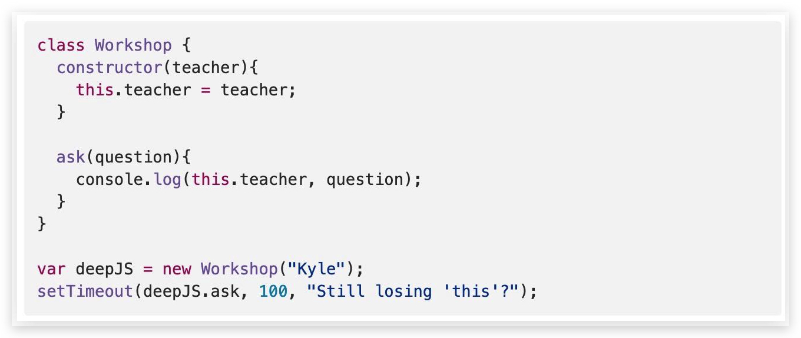

<!-- START doctoc generated TOC please keep comment here to allow auto update -->
<!-- DON'T EDIT THIS SECTION, INSTEAD RE-RUN doctoc TO UPDATE -->
## Table Of Content

- [Trap All in One](#trap-all-in-one)
- [Interview Question](#interview-question)
- [Source](#source)

<!-- END doctoc generated TOC please keep comment here to allow auto update -->

### Trap All in One
- What's the result?
- Explain what happend behind the scene?
<div style="text-align:center; margin:auto"></div>

### Interview Question
```javascript
var x = "1"; 
var y = 1; 
a = x + y;
console.log(a);
console.log(x == y);
console.log(x === y);
```
```javascript
var j =0;
for(var i=0; i<10; i++){
  // console.log(i);
setTimeout(function(){
   j +=i;
},i*1000)
}
```

### Source
[Kyle Simpson: Deep Javascript Foundations v3](https://frontendmasters.com/courses/deep-javascript-v3/)