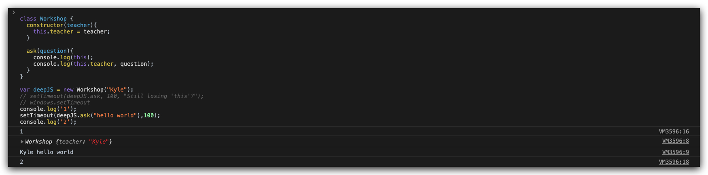
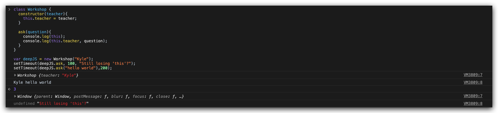

<!-- START doctoc generated TOC please keep comment here to allow auto update -->
<!-- DON'T EDIT THIS SECTION, INSTEAD RE-RUN doctoc TO UPDATE -->
## Table Of Content

- [Reference](#reference)
- [Functional Programming](#functional-programming)
- [Typescript](#typescript)
- [解决浮点问题](#%E8%A7%A3%E5%86%B3%E6%B5%AE%E7%82%B9%E9%97%AE%E9%A2%98)
- [Issues](#issues)

<!-- END doctoc generated TOC please keep comment here to allow auto update -->

 ### Reference
 - [Functional Programming](https://medium.com/javascript-scene/master-the-javascript-interview-what-is-functional-programming-7f218c68b3a0)
 - [Pure Function](https://medium.com/javascript-scene/master-the-javascript-interview-what-is-a-pure-function-d1c076bec976)
 - [Side Effect](https://frontendmasters.com/courses/functional-js-lite/side-effects/)
 - [Learn you a haskell for great good](http://learnyouahaskell.com/chapters)
 - [FP CMU Course](http://www.cs.cmu.edu/~15150/index.html)
 - [Haskell](http://www.aqee.net/post/why-haskell-is-worth-learning.html)
 - [Elixir](https://elixir-lang.org/)
  
### Functional Programming
> extract side effect rather than terminate it

### Typescript
> Typescript define the type
> Kyle tells you to know types before using them.

### 解决浮点问题
```javascript
Math.abs(0.3 - (0.1+0.2)) < 1e-6
```

### Issues
<div style="text-align:center; margin:auto"></div>
<div style="text-align:center; margin:auto"></div>

