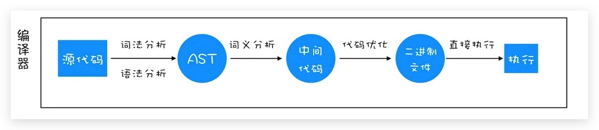
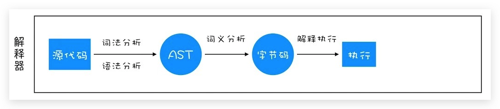

<!-- START doctoc generated TOC please keep comment here to allow auto update -->
<!-- DON'T EDIT THIS SECTION, INSTEAD RE-RUN doctoc TO UPDATE -->
## Table Of Content

- [Trap All in One](#trap-all-in-one)
- [Interview Questions](#interview-questions)
  - [Coercion](#coercion)
  - [Tricky one](#tricky-one)
  - [Why `Kyle` is not in the global object?](#why-kyle-is-not-in-the-global-object)
  - [How to identify Scope?](#how-to-identify-scope)
- [Commons:](#commons)
  - [Scope and Object](#scope-and-object)
  - [Terms](#terms)
  - [Lexical Scope](#lexical-scope)
  - [Dynamic scope](#dynamic-scope)
  - [Override Binding](#override-binding)
  - [`prototype` on Arrow Function](#prototype-on-arrow-function)
  - [Shadow Prototypes](#shadow-prototypes)
- [Reference](#reference)

<!-- END doctoc generated TOC please keep comment here to allow auto update -->

### Trap All in One
- What's the result?
- Explain what happend behind the scene?
<div style="text-align:center; margin:auto"></div>

### Interview Questions
#### Coercion
```javascript
var x = "1"; 
var y = 1; 
a = x + y;
console.log(a);
console.log(x == y);
console.log(x === y);
```
#### Tricky one
```javascript
var j =0;
for(var i=0; i<10; i++){
  // console.log(i);
setTimeout(function(){
   j +=i;
},i*1000)
}
```

#### Why `Kyle` is not in the global object?
```javascript
// Object.prototype.teacher = 'kyle';
global.teacher = 'James'
var teacher = 'Kyle';
function ask(question){
  console.log(this.teacher, question);
}

function otherClass(){
  var teacher = "Suzy";
  // the object context is not otherClass()
  ask("Why?")
}
otherClass();
```
> - `global object `is different from `global scope`
> - `closure` can happen both on **scope** or **object** perspectives
> - `this` can **only** happen in the **object** perspective
> - `var teacher` is defined in the **global** scope

#### How to identify Scope?
- `this`'s scope will the be **global object** rather than **workshop** because `object is not a scope`
- global **scope** doesn't have `this`, so by default it is `{}`;
- `Only` **function scope** has `this`
```javascript
var workshop = {
  teacher: 'Kyle',
  ask: (question) => {
    console.log(this.teacher, question);
  }
}
// the scope outside ask is the global, since object does not define scope.
console.log(workshop.ask("What happened to 'this'?"))
// arrow function doesn't have this keyword -> undefined
workshop.ask.call(workshop, "Still no 'this'?");
```

### Commons:
- Don't use MDN, use [ecma-262](https://www.ecma-international.org/ecma-262/9.0/#sec-tostring)
- Polyfill Pattern
```javascript
if (!Object.is) {
  Object.is = function ObjectIs() {
    ...
  }
}
```
#### Scope and Object
- `teacher` trace `lexical scope`
- `this.teacher` trace **execution context** and then **prototype chain**

#### Terms
- **Shadowing**: have two variables in **different** scopes with the **same** name

- **Left and Right Position**
  - **Left**: the variable to be signed a value to
  - **Right**: the value to be assigned to a varibale.
- **Compile Time**
  - declare the left side things  
- **Run Time**
  - execute the right side things
- **parameter vs argument**
  - **parameter**: left side thing for obtaining values
  - **argument**: right side thing for extracting values

#### Lexical Scope
- AkA: **static scope**
- The scope is decided during the **compile** stage
```c
void fun()
{
    int x = 5;
    void fun2()
    {
        printf("%d", x);
    }
}
```
#### Dynamic scope
- The scope is decided in the **run** stage, depends on the call chain of method.
```c
void fun()
{
    printf("%d", x);
}

void dummy1()
{
    int x = 5;
    fun();
}

void dummy2()
{
    int x = 10;
    fun();
}
```

#### Override Binding
- If you have already use `bind`,
- You can only use `new` to override the binding object;

#### `prototype` on Arrow Function
- Arrow Function doesn't have `this`.
- Arrow Function doesn't have any prototype.
- So you can not call `new` on an arrow function.

#### Shadow Prototypes
- **shadow** means **override**.

### Reference
- [你不知道的JS](./Reference/)


### v8引擎基本原理
- **编译器**: Compiler
- **解释器**: Interpreter
- **抽象语法树**: AST
- **字节码**: Bytecode
- **即时编译器**: JIT

#### 编程语言类型
##### 编译型语言
在执行程序之前，会将代码编译成为**二进制**文件；每次运行时只需要运行二进制文件即可，无需重新编译，C/C++, GO等都是编译型语言。生成过程会占用大量内存，因为有中间代码的产生。
<div style="text-align:center; margin:auto"></div>

##### 解释型语言
先将源代码翻译成**字节码**，然后逐行解释执行；每次运行时都需要通过**解释器**对程序动态解释及执行; 生成过程不会占用大量内存，因为字节码比中间代码小很多。
<div style="text-align:center; margin:auto"></div>

#### V8
- **生成AST**: `tokenize`, `parse`
- **生成执行上下文**
- 解释器`Ignition`将AST生成**字节码**
- **执行代码**(`JIT`)
  - 如果是第一次执行该代码，则Ignition逐行解释执行
  - 如果遇到HotSpot代码，则TurboFan进入编译，保存为高效的二进制文件
<div style="text-align:center; margin:auto"></div>

### 内存空间
#### 代码空间
- 用来存储可执行代码

#### 栈空间
- 先进后出用维护`执行上下文`顺序
- 对上下文切换效率有要求，只适合存储**小**型数据: `primitive`, `reference`
- 垃圾回收由`ESP指针`下移来实现

#### 堆空间
- 适合存储**大**型数据，内存分配和回收会消耗一定时间
- 存储**对象**(`闭包`), 内存泄露发生在这里
- 垃圾回收由`GC`来完成, 会被分割成为`新生代`(`副垃圾`回收器 **Scanvenger算法**)和`老生代`(`主垃圾`回收器，**增量标记算法**)

### 执行上下文
#### 何时开始
- `全局`运行
- **调用**`函数`(编译阶段只会将函数存储到堆中)
- 运行`eval`()

#### 生命周期
- **代码编译**: `函数`调用或者`全局`才会进入编译;
  - 创建**变量环境**: `var`(提升定义和初始化-undefined)
  - 创建**词法环境**: 块级作用域由词法作用域中的小型栈来维护
    - `let`(只提升定义,状态为uninitialzied), 
    - `const`(只提升定义,状态为uninitialized)
    - `func 声明`(提升且直接赋值，本身存储在heap中; 会覆盖掉同名变量, 但是可以重新赋值)
    - `func 表达式`(提升定义和初始化-undefined)
    - `func 参数`(初始化-undefined)
    - 
  - 确定**词法作用链**: 看**源代码**就能确定: (具体实现是有`outer`引用实现的)
    - 全局作用域
    - 函数作用域
    - 块级作用域
    - **对象并不构成作用域**
  - 确定`this`指向: `new` > `apply/call/bind` > `object context` > `gloabl/undefind`
- **代码执行**
  - 函数参数赋值
  - 标识符赋值(`const`未赋值会报错，`let`未赋值会默认为`undefined`)
  - 函数调用(会创建新的`执行上下文`)
- **垃圾回收**
  - 调用栈中的垃圾回收是靠ESP指针下移来实现的(不是GC)

### 闭包
#### 定义
- 在JavaScript 中，根据**词法作用域**的规则，内部函数总是可以访问其`外部作用域`中声明的变量，当通过调用一个`外部函数`返回一个`内部函数`后，即使该外部函数的**执行上下文**已经销毁，但是内部函数引用的**其外部的**变量依然以`对象`的形式保存在**内存堆**中，我们就把这些`变量的集合`称为**闭包**。比如外部函数是`foo`，那么这些变量的集合就称为`foo`函数的**闭包**。
- **闭包的本质是返回`函数`及其所引用的`外部变量`，外部变量的查询依然遵照`作用域链`的原则**

#### 产生
- 编译期间: 预先扫描函数、
- 遇到函数时，要先`预扫描`一遍
- 如果引用外部变量，则会形成闭包的引用，这是闭包并未在内存中建立
- 只有

#### 例子
- 1号栗子
```javascript
function a() {
  const x = 123;
  function b(){
    console.log(x);
  }
  return b;
}
a()(); // x 是b()的闭包；
```
- 2号栗子
```javascript
var bar = {
    myName:"time.geekbang.com",
    // 不会close over上面的myName,因为上层是对象
    printName: function () {
        console.log(myName)
    }    
}
function foo() {
    let myName = "极客时间"
    return bar.printName
}
let myName = "极客邦"
let _printName = foo()
_printName()
bar.printName()
```
#### 作用
- **数据封装**(data as private)
- **工厂模式**(Factory Pattern)
- **模块基础**(Module Pattern)
#### 销毁
- 伴随着`引用它的函数`的销毁而销毁
- 如果引用闭包的**函数**是一个`全局变量`，则闭包会一直存在直到`页面关闭`，因此可能会造成内存泄露
```javascript
function play1() {
  const x = 1;
  console.log(x);
}
function get(){
  return play1;
}
get()();
```
- 如果引用闭包的**函数**是个`局部变量`，等函数销毁后，在**下次** JavaScript引擎执行垃圾回收时，判断闭包这块内容如果已经不再被使用了，那么JavaScript引擎的垃圾回收器就会回收这块内存。
```javascript
const x = 1;

function play1() {
  console.log(x);
}

function get(){
  function play2() {
    console.log(x);
  }
  return play2;
}

get()();
```
- 如果该`闭包`会一直使用，那么它可以作为`全局变量`而存在；
- 如果使用频率不高，且占用内存较大的话，那就尽量让它成为一个`局部变量`;
- 可以沟通设置闭包函数为null来释放闭包

### this
#### 设置优先级
- `new` 
- `call`/`bind`/`apply` **死绑定**
- `object context`
- `global`(non-strict)/`undefined`(strict)

#### 解决this太活跃的问题
- 保存`this`为`self`变量然后传入(从外层到内层)
- 使用`Arrow Function`
> 本质上都是将`this`机制转化为`scope chain`机制

### Arrow Function
- 不会创建新的执行上下文
- `this`的查找依赖于Scope Chain
```javascript
var myObj = {
  name : "极客时间", 
  showThis: function(){
    console.log(this)
    var bar = ()=>{
      this.name = "极客邦"
      console.log(this)
    }
    bar()
  }
}
myObj.showThis()
console.log(myObj.name)
console.log(window.name)
```


### 注意的点
- 函数调用时才会对其进行编译
- 函数编译时，变量和内部函数声明会被赋值，var定义及初始化为被提升，let，const的定义会被提升，不会被初始化。
- 变量和函数重名时，函数提升优先级更高; 但是可以被重新赋值
```javascript
alert(a);//输出：function a(){ alert('我是函数') }
function a(){ alert('我是函数') }//
var a = '我是变量';
alert(a);   //输出：'我是变量'
```
- let在未赋值后使用，将自动化初始化为undefined
```javascript
let b;
console.log(b);
```

